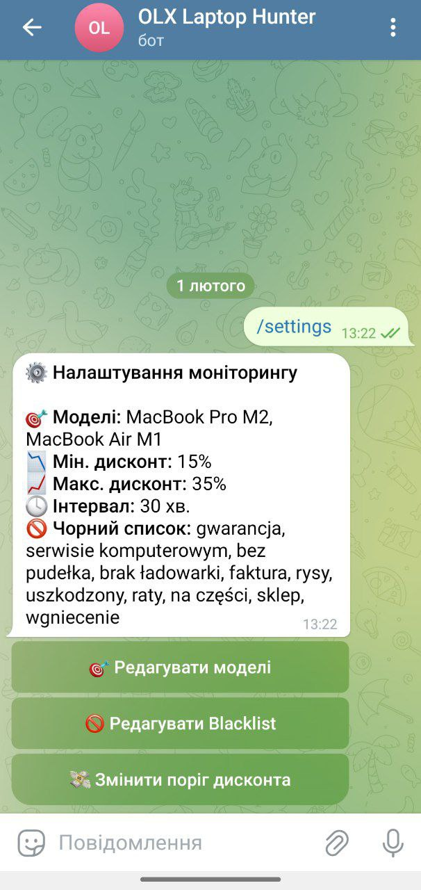
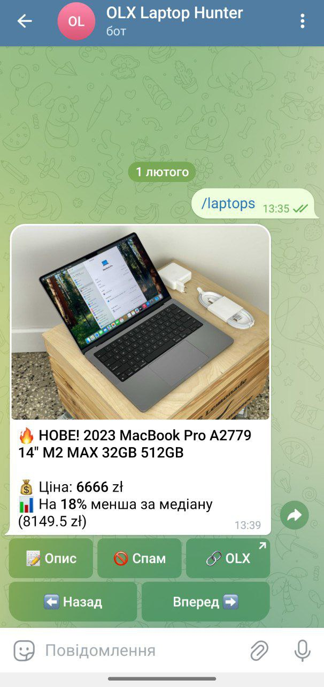

# 💻 LaptopMarketAnalyzer-OLX 📉

**Advanced analytical engine with a Telegram Command Center for professional deal hunting.**

This project is a fault-tolerant ETL tool designed to monitor the used laptop market on OLX.pl. It utilizes **multithreaded scraping**, **fuzzy matching**, and **Pandas-based statistical analysis** to detect offers priced **15-35% below the market median**.

---

## 🚀 Key Features

* **Smart Scraping:** Multithreaded data collection (`ThreadPoolExecutor`) with User-Agent rotation to bypass bot protection.
* **Market Analytics:** Calculates median prices for specific models (RAM/CPU/Disk grouping) and identifies "Hot Deals" using a custom `Deal Score` algorithm.
* **Fuzzy Matching:** Automatically categorizes unstructured ad titles using `RapidFuzz` to map them to target models (e.g., "Lenovo Legion 5" vs "Legion5 pro").
* **Telegram Command Center:** Full UI control via an async bot (`Aiogram 3.x`).
    * Dynamically add/remove target models.
    * Manage blacklists to filter out spam (e.g., "broken", "parts only").
    * Adjust profitability thresholds and scan intervals on the fly.

## 📱 Interface & Demo

To provide the best user experience, the bot features a clean interface and detailed deal analysis.

| Main Bot Menu | Hot Deal Notification |
| :---: | :---: |
|  |  |

## 🛠 Tech Stack

* **Core:** Python 3.13
* **Data Analysis:** Pandas, NumPy
* **Scraping:** Requests, BeautifulSoup4, Fake-Headers
* **Logic:** RapidFuzz (String matching), Dataclasses
* **Interface:** Aiogram 3 (AsyncIO)

## ⚙️ Installation & Setup

1.  **Clone the repository:**
    ```bash
    git clone [https://github.com/DevDmytroTym/LaptopMarketAnalyzer-OLX.git](https://github.com/DevDmytroTym/LaptopMarketAnalyzer-OLX.git)
    cd LaptopMarketAnalyzer-OLX
    ```

2.  **Install dependencies:**
    ```bash
    pip install -r requirements.txt
    ```

3.  **Configure the project:**
    Create a `config.json` file in the root directory (or rename `config.example.json` if provided) and add your Telegram Bot Token:
    ```json
    {
        "token": "YOUR_TELEGRAM_BOT_TOKEN",
        "chat_id": "",
        "models": ["Lenovo Legion 5", "MacBook Air M1"],
        "blacklist": ["brak ładowarki", "uszkodzony"],
        "min_deal_score": 0.15,
        "check_interval": 30
    }
    ```

4.  **Run the system:**
    ```bash
    python main.py
    ```

## 📈 How It Works (The Math)

The system calculates a **Deal Score** for every ad to determine its profitability:

$$DealScore = 1 - \frac{Price}{MedianPrice}$$

* **MedianPrice** is calculated based on a group of identical laptops (Same Model + CPU + RAM + SSD).
* Only groups with **>4 listings** are considered statistically relevant.
* If `DealScore > 0.15` (15%), the offer is flagged as a "Hot Deal" and sent to the Telegram Bot.

## 🕹 Bot Commands

* `/start` - Initialize the bot.
* `/scan` - Force a manual market scan immediately.
* `/laptops` - View the current list of found deals.
* `/settings` - Open the Command Center to adjust models, blacklist, and intervals.

## 🗺 Future Roadmap

- [ ] **Database Migration:** Transition from CSV files to **SQL** (PostgreSQL) for better data management and scalability.
- [ ] **Containerization:** Implement **Docker** to ensure stable server-side deployment and 24/7 uptime.
- [ ] **Advanced NLP:** Enhance the text analysis module for more precise extraction of GPU models and battery health status from ad descriptions.
- [ ] **Market Expansion:** Scale the analytical engine to cover smartphones, gaming consoles, and other electronics categories.

## 📜 License
Distributed under the MIT License. See `LICENSE` for more information.

